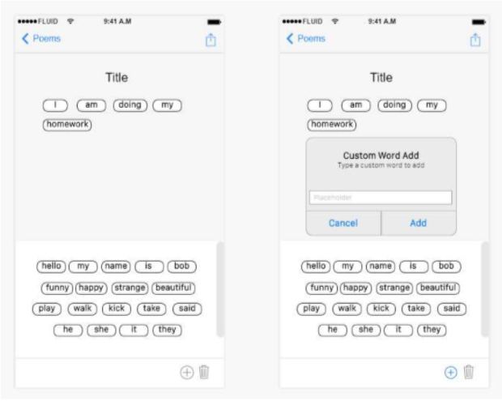
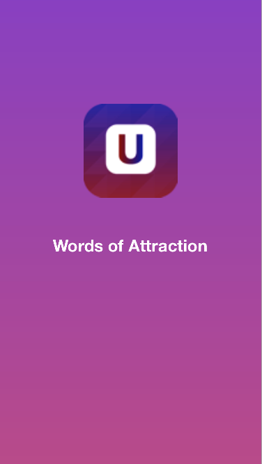
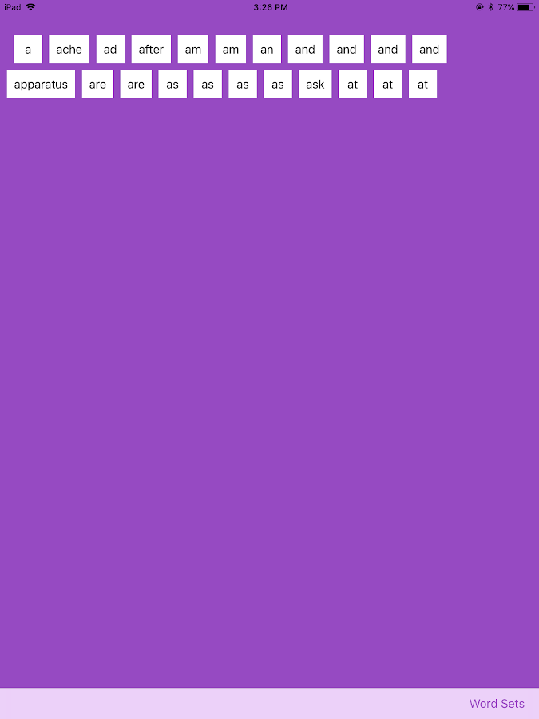
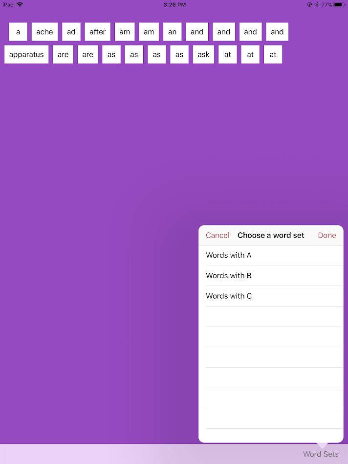

# Words of Attraction
Claire Koval and Danny Kim

A magnetic poetry app created in Swift for IGME-340 Spring

## Proposed Features
- Add custom words
- Deleting words with animated trash can icon that gets bigger as word gets closer to the icon
- Shake or press button to clear screen and move words back to the top.

## Checkpoint 1
### Initial Sketches

Word would ideally be positioned at the bottom so that the user feels gets the feeling of texting. There will be an export button at the top to save to gallery, save to app, or export/share on other apps

User interaction with the pan gesture draggability is working, and the words start off at the top of the screen. It works on iPhone and iPad.

### Current Features
- Words can be dragged (no zoom or rotation)

### Upcoming
Look into customizing background colors, labels, and word fonts. 
Will make the UI and Loadscreen more visually pleasing.

## Checkpoint 2
### Updated Icon and Launch Screen

### New Main Words Page

### Word Set Menu
The user can load at least 3 distinct sets of words, sorted alphabetically.

### Updated Features
- The user can load at least 3 distinct sets of words. 
- Before loading a new word set the app needs to get rid of all of the old UILabels. 
- Hides the status bar.
- Springboard app name matches the name on the icon.
- Updated the icon and load-screen

### Upcoming
- Looking to add and delete words
- State Preservation. The user's current chosen category will be stored in UserDefaults, and the chosen word set will be displayed in when they launch the app.
- Use a larger font size when creating word magnets for an iPad. Be sure that the words can still fit on the smallest iPhone screens (the iPhone 5/iPhone SE)
- The user can share their poetry (a screenshot of the entire poem) with others using Social Networks with the UIActivityViewController class.
- The user can choose a poetry background image from their Photo Library with the UIImagePickerController class.
- Have a model class that manages/contains application data.
- Use dependency injection and do not make this a strict singleton
